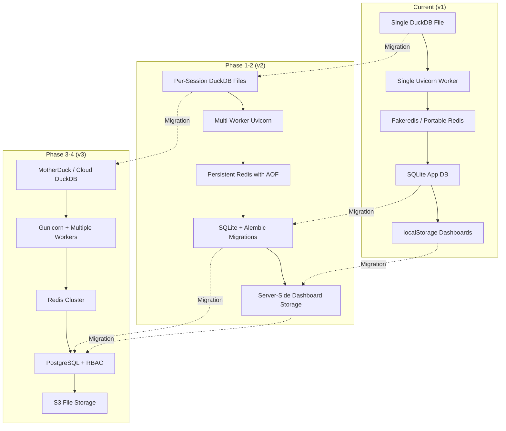

# Spencer BI Engine — Future Scope & Hardening Roadmap

> **Goal:** Transform Spencer from a powerful local-first BI prototype into a
> break-proof, production-grade, enterprise-ready analytics platform.

---

## Table of Contents

1. [Current State Assessment](#1-current-state-assessment)
2. [Phase 1 — Break-Proof Stability (Week 1–2)](#2-phase-1--break-proof-stability-week-12)
3. [Phase 2 — Production Hardening (Week 3–4)](#3-phase-2--production-hardening-week-34)
4. [Phase 3 — Feature Parity with Power BI (Month 2–3)](#4-phase-3--feature-parity-with-power-bi-month-23)
5. [Phase 4 — Enterprise & Scale (Month 4–6)](#5-phase-4--enterprise--scale-month-46)
6. [Phase 5 — SaaS & Monetization (Month 6+)](#6-phase-5--saas--monetization-month-6)
7. [Architecture Evolution Map](#7-architecture-evolution-map)
8. [Risk Register](#8-risk-register)
9. [Priority Matrix](#9-priority-matrix)

---

## 1. Current State Assessment

### What Spencer Does Well Today
- **Columnar Speed:** DuckDB in-process engine handles ~10M row datasets with sub-second aggregation
- **AI Query Engine:** NL-to-SQL with 3-attempt self-correction, conversation history, and a strict Review Gate (never auto-executes)
- **Data Preparation:** 16 visual transforms with live dry-run previews, 10-step undo/redo via DuckDB snapshot tables
- **Canvas Dashboard:** 13 chart types on a drag-and-drop 12-column grid with cross-filtering, multi-page support, and PDF/PNG export
- **Security Depth:** Triple-layer SQL defense (AST validation → transaction rollback sandbox → tenant scope gate), formula function allowlist, bound file parameters
- **Multi-Key LLM Pool:** Automatic key rotation across 7 Gemini API keys with per-minute burst and per-day quota tracking

### What Breaks or Hurts Today

| Area | Problem | Severity |
|------|---------|----------|
| **LLM Availability** | All 7 keys exhaust daily quota → 429 errors for the rest of the day | 🔴 Critical |
| **DuckDB Single-Writer** | One `spencer.db` file, one process — cannot scale to multiple workers | 🔴 Critical |
| **No Redis Persistence** | Server restart loses all session metadata, schema caches, LLM cooldown state | 🟠 High |
| **No Password Reset** | "Forgot password?" is a dead placeholder | 🟠 High |
| **No Email Verification** | Anyone can register with any email string | 🟠 High |
| **No Rate Limiting on Auth** | `/auth/login` and `/auth/register` have zero brute-force protection | 🟠 High |
| **Dashboards in localStorage** | Clearing browser data destroys all saved dashboards permanently | 🟠 High |
| **No Async Query Worker** | Large queries block the single Uvicorn thread pool | 🟡 Medium |
| **No Alembic Migrations** | Schema changes require manual DDL — risky on production deploys | 🟡 Medium |
| **No Automated Tests** | Zero test coverage in CI — regressions are caught manually | 🟡 Medium |
| **Dual Theme Color Controls** | `TableSwitcher` and `DashboardSettings` both set accent colors independently | 🟢 Low |
| **Orphan Table Cleanup** | Dev/test DuckDB tables created without `uploads/` dirs escape the sweeper | 🟢 Low |

---

## 2. Phase 1 — Break-Proof Stability (Week 1–2)

> **Objective:** Eliminate every crash path, silent failure, and data loss vector.

### 2.1 LLM Resilience & Fallback Chain

**Problem:** When all Gemini keys are rate-limited, the entire AI layer goes dark.

**Solution — Multi-Provider Fallback Chain:**
```
Primary:   gemini/gemini-3.6-flash  (7 pooled keys)
Fallback:  gemini/gemini-2.5-flash  (if available on account)
Emergency: anthropic/claude-haiku   (cheap, fast, always-on)
Local:     ollama/llama3.2          (zero-cost offline fallback)
```

**Implementation:**
- Add `SPENCER_LLM_FALLBACK_MODELS` env var (comma-separated model list)
- In `ai_service._call_llm()`, after exhausting all keys for the primary model, iterate through fallback models before raising `LLMRateLimitError`
- Each fallback model uses its own key pool (or `api_key=None` for env-based auth)
- Add a circuit breaker: if a provider fails 3× in 5 minutes, skip it for 10 minutes
- Surface the active model name in the API response so the frontend can show "Powered by Gemini" / "Powered by Claude" badges

**Files:** `backend/services/ai_service.py`, `backend/services/llm_key_pool.py`, `backend/.env`

---

### 2.2 Redis Crash Recovery

**Problem:** Portable Redis restart wipes session metadata, schema caches, and LLM cooldown state.

**Solution — Dual-Layer State Recovery:**
1. **Redis AOF Persistence:** Enable `appendonly yes` in Redis config for write-ahead logging
2. **DuckDB-as-Source-of-Truth Rebuild:** On startup, if `schema:{uuid}` is missing from Redis but `t_{uuid}_*` tables exist in DuckDB, auto-rebuild the schema cache from `PRAGMA table_info` + `COUNT(DISTINCT)` sampling
3. **Graceful Degradation:** If Redis is completely unreachable in production, serve requests with in-memory dict cache (no cross-restart persistence, but no crash)

**Files:** `backend/services/redis_manager.py`, `backend/services/session_service.py` (new recovery module)

---

### 2.3 Frontend Error Boundaries & Retry Logic

**Problem:** Network errors, 429s, and 503s silently swallow in many components.

**Solution:**
- Wrap every API call in `api.ts` with a global retry interceptor:
  - **429:** Parse `Retry-After` header, show countdown toast ("AI busy, retrying in 45s..."), auto-retry once
  - **502/503:** Immediate retry once with 2s delay, then show error toast
  - **Network Error:** Show "Connection lost" banner with manual retry button
- Add Vue `<ErrorBoundary>` components around each major view to catch render crashes without white-screening
- Add a global `window.onerror` and `window.onunhandledrejection` handler that sends errors to a toast instead of silently dying

**Files:** `frontend/src/services/api.ts`, `frontend/src/components/ErrorBoundary.vue` (new), `frontend/src/App.vue`

---

### 2.4 Dashboard Persistence to Backend

**Problem:** All dashboards live exclusively in browser `localStorage`. Clearing cache = total dashboard loss.

**Solution — Server-Side Dashboard Storage:**
1. Add `dashboards` table to `spencer_app.db`:
   ```sql
   CREATE TABLE dashboards (
     id          INTEGER PRIMARY KEY AUTOINCREMENT,
     user_id     INTEGER NOT NULL REFERENCES users(id),
     session_id  TEXT    NOT NULL,
     name        TEXT    NOT NULL,
     pages_json  TEXT    NOT NULL,   -- JSON blob of all pages + tile configs
     created_at  TIMESTAMP DEFAULT CURRENT_TIMESTAMP,
     updated_at  TIMESTAMP DEFAULT CURRENT_TIMESTAMP
   );
   ```
2. Add REST endpoints: `POST /sessions/{uuid}/dashboards`, `GET /sessions/{uuid}/dashboards`, `PUT /dashboards/{id}`, `DELETE /dashboards/{id}`
3. Frontend `useDashboards.ts` writes to both localStorage (instant) AND backend (async debounced). On page load, merge: backend wins on conflict (newer `updated_at`)
4. **Migration:** On first backend save, upload existing localStorage dashboards automatically

**Files:** `backend/models/app_db.py`, `backend/routers/dashboard.py` (new), `backend/services/dashboard_service.py` (new), `frontend/src/composables/useDashboards.ts`

---

### 2.5 Auth Hardening

**Problem:** No brute-force protection, no email verification, no password reset.

**Solution:**
1. **Rate Limiting:** Add `slowapi` with per-IP limits:
   - `/auth/login`: 5 attempts per minute per IP
   - `/auth/register`: 3 per hour per IP
   - `/sessions/{uuid}/ask`: 30 per minute per user (LLM cost gate)
2. **Account Lockout:** After 10 failed login attempts in 15 minutes, lock account for 30 minutes. Store attempt counter in Redis.
3. **Password Reset Flow:**
   - `POST /auth/forgot-password` → generates time-limited JWT reset token → sends email via SMTP (Resend / SendGrid)
   - `POST /auth/reset-password` → validates token → updates bcrypt hash
4. **Email Verification (Optional):**
   - On registration, set `email_verified = False`
   - Send verification link with JWT token
   - Block AI endpoints until verified (data prep works fine without)

**Files:** `backend/routers/auth.py`, `backend/services/auth_service.py`, `backend/services/email_service.py` (new), `backend/models/app_db.py`

---

### 2.6 Automated Test Suite

**Problem:** Zero automated test coverage. Regressions are only caught when the user hits them live.

**Solution — Layered Test Strategy:**
1. **Unit Tests (pytest):**
   - `test_sql_validator.py` — fuzz the AST validator with 50+ attack payloads (SQL injection, cross-tenant reads, I/O functions)
   - `test_transform_service.py` — validate every transform op produces correct DuckDB SQL
   - `test_auth_service.py` — bcrypt hashing, JWT minting/validation, duplicate user rejection
   - `test_aggregate_service.py` — KPI, 1-D, 2-D, scatter, box plot compilation
2. **Integration Tests (TestClient):**
   - Full upload → transform → query → export pipeline
   - Cross-tenant isolation (user A cannot read user B's tables)
   - LLM mock tests (patch `_call_llm` to return canned SQL, verify self-correction loop)
3. **Frontend Tests (Vitest):**
   - Composable unit tests (`useSession`, `useAuth`, `useDashboards`)
   - Component snapshot tests for critical UI (OpDialog, ChartTile, DataGrid)
4. **CI Pipeline (GitHub Actions):**
   ```yaml
   on: [push, pull_request]
   jobs:
     backend-tests:
       - uses: actions/setup-python@v5
       - run: uv run pytest -x --tb=short
     frontend-tests:
       - uses: actions/setup-node@v4
       - run: npm run test
     lint:
       - run: ruff check backend/
       - run: npx eslint frontend/src/
   ```

**Files:** `backend/tests/` (new directory), `frontend/vitest.config.ts` (new), `.github/workflows/ci.yml` (new)

---

## 3. Phase 2 — Production Hardening (Week 3–4)

### 3.1 Alembic Database Migrations

**Problem:** `Base.metadata.create_all()` is brittle — adding a column to `users` or `datasets` requires manual DDL.

**Solution:**
- Initialize Alembic with `alembic init backend/migrations`
- Create initial migration from current schema
- All future schema changes go through `alembic revision --autogenerate`
- Add `alembic upgrade head` to the startup sequence in `run_dev.py` and production entrypoint

**Files:** `backend/alembic.ini`, `backend/migrations/` (new)

---

### 3.2 Async Query Worker with WebSocket Progress

**Problem:** Large analytical queries (multi-million rows, complex joins) block the Uvicorn thread pool, causing timeouts and degraded responsiveness.

**Solution:**
1. Add a `BackgroundTasks` queue using Python's `asyncio.Queue` (lightweight, no Celery dependency for now)
2. `POST /sessions/{uuid}/execute` returns immediately with a `query_id`
3. Client opens a WebSocket at `/ws/sessions/{uuid}/queries/{query_id}` to receive:
   - `{"status": "running", "elapsed_ms": 1200}`
   - `{"status": "complete", "rows": 5000, "columns": [...]}`
   - `{"status": "error", "message": "..."}`
4. `POST /admin/kill-query/{query_id}` sends `conn.interrupt()` to DuckDB
5. Frontend `QueryConsole.vue` shows a progress spinner with elapsed time and a cancel button

**Files:** `backend/routers/query.py`, `backend/services/query_worker.py` (new), `frontend/src/components/QueryConsole.vue`

---

### 3.3 Structured Logging & Observability

**Problem:** Logs are unstructured `print()`-style lines. No metrics, no tracing, no alerting.

**Solution:**
1. **Structured JSON Logging:** Replace all `logger.info/warning` with structured JSON (using `structlog` or `python-json-logger`)
2. **Request Tracing:** Add a middleware that generates a `X-Request-ID` UUID for every request, propagated through all log entries
3. **Metrics Endpoint:** Expose `/metrics` in Prometheus format:
   - `spencer_llm_calls_total{provider, model, status}`
   - `spencer_llm_latency_seconds{provider}`
   - `spencer_queries_total{type}`  (transform, aggregate, ai_execute)
   - `spencer_active_sessions_gauge`
   - `spencer_upload_bytes_total`
4. **Health Check:** `GET /health` → `{"status": "ok", "db": "connected", "redis": "connected", "uptime_s": 12345}`
5. **Error Tracking (Optional):** Sentry SDK integration with DSN from env var

**Files:** `backend/middleware/` (new), `backend/routers/health.py` (new), `backend/config.py`

---

### 3.4 Input Validation & Payload Hardening

**Problem:** Some endpoints accept large payloads without strict validation.

**Solution:**
- Add Pydantic `Field(max_length=...)` constraints to every string input:
  - `question`: max 2000 chars
  - `formula`: max 5000 chars
  - `column_name`: max 128 chars, regex `^[A-Za-z_][A-Za-z0-9_ ]*$`
  - `table_name`: max 128 chars
- Add `Content-Length` middleware cap (50MB default, configurable)
- Add `json.loads` depth limiter for nested JSON payloads
- Validate `sort` parameter format in `/data` to prevent injection through sort column names

**Files:** `backend/models/schemas.py`, `backend/middleware/content_length.py`

---

## 4. Phase 3 — Feature Parity with Power BI (Month 2–3)

### 4.1 Live Data Connectors

**Problem:** Spencer is upload-only. Real analysts need live connections to databases and SaaS platforms.

**Solution — Connector Framework:**
```
┌─────────────────────────────────────────────┐
│            Spencer Connector Hub            │
├─────────┬──────────┬───────────┬────────────┤
│ PostgreSQL│ MySQL   │ Snowflake │ BigQuery   │
│ ClickHouse│ SQLite  │ S3 Parquet│ Google     │
│ DuckDB   │ MongoDB │ (Iceberg) │  Sheets    │
│ (remote) │ (read)  │           │            │
└─────────┴──────────┴───────────┴────────────┘
```

**Implementation:**
1. Add `connectors/` module with a `BaseConnector` abstract class:
   ```python
   class BaseConnector(ABC):
       @abstractmethod
       async def test_connection(self, config: dict) -> bool: ...
       @abstractmethod
       async def list_tables(self, config: dict) -> List[str]: ...
       @abstractmethod
       async def import_table(self, config: dict, table: str, session_uuid: str) -> str: ...
   ```
2. Each connector implements `import_table()` by streaming data into DuckDB via `COPY` or `INSERT INTO ... SELECT FROM`
3. Add `POST /sessions/{uuid}/connect` endpoint with connector type and credentials
4. Frontend: Add a "Connect to Database" option alongside "Upload File" in `UploadDropzone.vue`
5. **Scheduled Refresh:** Combine with APScheduler to auto-refresh connected tables on a cron schedule

**Files:** `backend/connectors/` (new directory), `backend/routers/connector.py` (new), `frontend/src/components/ConnectorDialog.vue` (new)

---

### 4.2 Visual Semantic Model & Multi-Table Joins

**Problem:** Spencer operates in single-active-table mode. No visual join builder, no relationship modeling.

**Solution — Relationship Canvas:**
1. Add a **Model View** (new route `/model`) with a visual canvas showing tables as cards and relationships as lines
2. Users drag columns between tables to create joins (inner, left, right, full)
3. Store relationships in Redis as `relationships:{session_uuid}`:
   ```json
   [
     {
       "left_table": "orders",
       "right_table": "customers",
       "left_column": "customer_id",
       "right_column": "id",
       "join_type": "LEFT"
     }
   ]
   ```
4. When aggregating for Canvas charts, the backend auto-applies the join chain
5. NL-to-SQL prompt includes the relationship graph so AI queries correctly join tables

**Files:** `frontend/src/views/ModelView.vue` (new), `backend/services/join_service.py` (new), `backend/services/ai_service.py` (prompt update)

---

### 4.3 Calculated Measures & DAX-like Metrics Layer

**Problem:** Spencer only has row-level calculated columns. No reusable aggregated measures (like `Profit Margin = SUM(profit) / SUM(revenue)`).

**Solution — Metrics Catalog:**
1. Add a `measures` store per session:
   ```json
   {
     "Profit Margin": {
       "expression": "SUM(\"profit\") / NULLIF(SUM(\"revenue\"), 0)",
       "format": "percent",
       "description": "Net profit as percentage of revenue"
     },
     "YoY Growth": {
       "expression": "(SUM(CASE WHEN year = EXTRACT(YEAR FROM CURRENT_DATE) THEN revenue END) - SUM(CASE WHEN year = EXTRACT(YEAR FROM CURRENT_DATE) - 1 THEN revenue END)) / NULLIF(SUM(CASE WHEN year = EXTRACT(YEAR FROM CURRENT_DATE) - 1 THEN revenue END), 0)",
       "format": "percent",
       "description": "Year-over-year revenue growth"
     }
   }
   ```
2. Measures appear in the Canvas field list alongside regular columns
3. When dropped onto a chart, the backend injects the measure expression into the aggregate query
4. AI can reference measures by name in NL-to-SQL prompts

**Files:** `backend/routers/measures.py` (new), `frontend/src/components/MeasureEditor.vue` (new)

---

### 4.4 Advanced Filter Panel (Power BI-style Slicers)

**Problem:** Current slicer is a single dropdown tile. Power BI has dedicated visual filter panels, date range slicers, numeric range sliders, and multi-select checkboxes.

**Solution:**
1. **Filter Pane:** Add a collapsible right-side filter panel on the Canvas (like Power BI's "Filters" pane)
2. **Filter Types:**
   - **Dropdown Multi-Select** (categorical columns)
   - **Date Range Picker** (date/timestamp columns — FROM/TO calendar)
   - **Numeric Range Slider** (numeric columns — min/max with drag handles)
   - **Search Filter** (free-text substring match)
   - **Top N Filter** (show top/bottom N by a measure)
3. **Scope Levels:**
   - **Visual-level filter** (applies to one tile only)
   - **Page-level filter** (applies to all tiles on the current page)
   - **Report-level filter** (applies across all pages)
4. All filters are additive (AND logic) and compose with cross-filter clicks

**Files:** `frontend/src/components/FilterPanel.vue` (new), `frontend/src/components/DateRangeSlicer.vue` (new), `frontend/src/components/NumericRangeSlicer.vue` (new)

---

### 4.5 Conditional Formatting & Data Bars

**Problem:** DataGrid is plain text. Power BI has conditional formatting, data bars, color scales, and icon sets.

**Solution:**
1. **Color Scales:** Apply background gradient (green → yellow → red) to numeric columns based on min/max range
2. **Data Bars:** Render inline horizontal bars inside cells proportional to value
3. **Icon Sets:** Show ▲ ▼ ► arrows based on value thresholds
4. **Rules Engine:** Users define rules: "If `profit_margin` < 0, highlight cell red"
5. Store formatting rules per column in the dashboard config

**Files:** `frontend/src/components/DataGrid.vue`, `frontend/src/utils/conditionalFormat.ts` (new)

---

### 4.6 Row-Level Security (RLS)

**Problem:** Any authenticated user who knows a session UUID can access all its data (ownership check exists, but no row-level filtering).

**Solution:**
1. Add `rls_rules` table in `spencer_app.db`:
   ```sql
   CREATE TABLE rls_rules (
     id          INTEGER PRIMARY KEY,
     session_id  TEXT NOT NULL,
     user_email  TEXT NOT NULL,
     filter_expr TEXT NOT NULL  -- e.g., "region = 'APAC'"
   );
   ```
2. Before any data query, inject `WHERE <rls_filter>` into the SQL
3. RLS filters are validated through the same `_validate_formula()` allowlist
4. Admin users bypass RLS

**Files:** `backend/services/rls_service.py` (new), `backend/routers/admin.py`

---

## 5. Phase 4 — Enterprise & Scale (Month 4–6)

### 5.1 Horizontal Scaling with DuckDB-WASM or MotherDuck

**Problem:** Single-process DuckDB with file lock cannot serve multiple Uvicorn workers or multiple servers.

**Options:**

| Option | Pros | Cons |
|--------|------|------|
| **MotherDuck** (cloud DuckDB) | Serverless, auto-scaling, shared state | Vendor lock-in, cost |
| **DuckDB per-session files** | Each session gets its own `.db` file, workers can parallelize | More file management, cross-session joins harder |
| **PostgreSQL + pg_duckdb** | Standard multi-writer RDBMS with DuckDB analytical extension | More infrastructure, higher latency for small queries |
| **Read replicas** | Primary writer + read-only replicas for `/data` and `/aggregate` | DuckDB doesn't natively support replication |

**Recommended Approach — Per-Session DuckDB Files:**
1. Replace single `spencer.db` with `spencer_{session_uuid}.db` per session
2. Each request opens the session-specific file, executes, and closes
3. Multiple Uvicorn workers can serve different sessions in parallel
4. Cross-session operations (admin sweep, storage metrics) iterate over session files
5. This is a stepping stone to MotherDuck migration later

**Files:** `backend/services/duckdb_manager.py` (major refactor)

---

### 5.2 Team Workspaces & RBAC

**Problem:** Spencer is single-user. No sharing, no teams, no role-based access.

**Solution:**
1. Add `organizations`, `org_members`, and `org_datasets` tables:
   ```sql
   organizations (id, name, created_by, created_at)
   org_members   (org_id, user_id, role ENUM('admin','editor','viewer'))
   org_datasets  (org_id, session_id, shared_by, shared_at)
   ```
2. **Roles:**
   - **Admin:** Full access, manage members, delete datasets
   - **Editor:** Upload, transform, create dashboards, run queries
   - **Viewer:** View dashboards and data only, no edits, no AI queries
3. **Sharing:**
   - "Share" button on any dataset → invite by email → creates `org_datasets` entry
   - Viewers get read-only access (all mutating endpoints return 403)
4. **Public Links:**
   - Generate a time-limited, read-only URL for embedding dashboards in external sites
   - `GET /public/{share_token}/dashboard` → renders dashboard in an iframe-safe mode

**Files:** `backend/models/app_db.py`, `backend/routers/org.py` (new), `backend/services/rbac_service.py` (new)

---

### 5.3 Scheduled Reports & Email Alerts

**Problem:** APScheduler exists for recurring queries, but there's no way to send results via email or Slack.

**Solution:**
1. After a scheduled query runs, render the results as a formatted HTML table
2. Optionally attach a PNG snapshot of the associated dashboard page
3. Deliver via:
   - **Email:** SMTP (Resend, SendGrid, SES)
   - **Slack:** Incoming webhook
   - **Microsoft Teams:** Webhook connector
4. **Alert Conditions:** "Send email if `total_revenue` drops below \$100,000"
5. Frontend: Add "Schedule & Alert" dialog accessible from Canvas and Query Engine

**Files:** `backend/services/notification_service.py` (new), `backend/routers/schedule.py` (extend)

---

### 5.4 Audit Log

**Problem:** No record of who did what, when. Critical for compliance and debugging.

**Solution:**
1. Add `audit_log` table:
   ```sql
   audit_log (
     id, user_id, session_id, action, detail_json,
     ip_address, user_agent, created_at
   )
   ```
2. Log all mutating actions: login, upload, transform, undo, delete, dashboard save, query execute, share, admin actions
3. `GET /admin/audit?user_id=&action=&from=&to=` for admin review
4. Auto-prune logs older than 90 days (configurable)

**Files:** `backend/services/audit_service.py` (new), `backend/models/app_db.py`

---

## 6. Phase 5 — SaaS & Monetization (Month 6+)

### 6.1 Multi-Tenant Cloud Deployment

```
┌──────────────────────────────────────────────────────────────┐
│                    Load Balancer (Nginx / Cloudflare)        │
├──────────────────────────────────────────────────────────────┤
│  ┌─────────┐  ┌─────────┐  ┌─────────┐  ┌─────────┐       │
│  │ Worker 1│  │ Worker 2│  │ Worker 3│  │ Worker N│       │
│  │ Uvicorn │  │ Uvicorn │  │ Uvicorn │  │ Uvicorn │       │
│  └────┬────┘  └────┬────┘  └────┬────┘  └────┬────┘       │
│       │            │            │            │              │
│  ┌────┴────────────┴────────────┴────────────┴────┐        │
│  │              Redis Cluster (ElastiCache)        │        │
│  └────────────────────┬───────────────────────────┘        │
│                       │                                     │
│  ┌────────────────────┴───────────────────────────┐        │
│  │           PostgreSQL (RDS / Aurora)             │        │
│  │     (users, orgs, dashboards, audit_log)        │        │
│  └────────────────────────────────────────────────┘        │
│                                                             │
│  ┌────────────────────────────────────────────────┐        │
│  │         S3 / GCS (DuckDB session files)         │        │
│  │     spencer_{session_uuid}.db per tenant         │        │
│  └────────────────────────────────────────────────┘        │
└──────────────────────────────────────────────────────────────┘
```

### 6.2 Billing & Usage Tiers

| Tier | Price | Limits |
|------|-------|--------|
| **Free** | \$0/mo | 3 datasets, 100MB storage, 50 AI queries/day, 1 user |
| **Pro** | \$19/mo | 20 datasets, 5GB storage, 500 AI queries/day, 5 users |
| **Team** | \$49/mo | Unlimited datasets, 50GB, unlimited AI, 25 users, RBAC, scheduled reports |
| **Enterprise** | Custom | SSO/SAML, audit logs, SLA, dedicated support, on-prem option |

**Implementation:**
- Stripe integration for subscription management
- Usage counters in Redis: `usage:{user_id}:{YYYY-MM-DD}:ai_queries`
- Middleware checks tier limits before expensive operations
- Upgrade prompts shown when limits are approached

### 6.3 Embeddable Analytics (iFrame SDK)

- Generate embeddable `<iframe>` snippets for individual charts or full dashboards
- JavaScript SDK: `<script src="spencer.js">` → `Spencer.embed('#container', { dashboardId: '...', token: '...' })`
- Supports theming, filtering, and event callbacks
- Revenue model: charge per embed view above free tier

---

## 7. Architecture Evolution Map



---

## 8. Risk Register

| Risk | Impact | Likelihood | Mitigation |
|------|--------|------------|------------|
| **Gemini API deprecation** | AI layer goes offline | Medium | Multi-provider fallback chain (Phase 1) |
| **DuckDB file corruption** | Total data loss for session | Low | Per-session files + S3 backup + snapshot tables |
| **localStorage quota exceeded** | Dashboard save fails silently | Medium | Server-side persistence (Phase 1) |
| **SQL injection via formula** | Cross-tenant data breach | Very Low | Existing AST allowlist + continuous fuzz testing |
| **Key/secret leak in git** | API key compromise | Low | `.gitignore` hardened, pre-commit hook scanning |
| **Single point of failure** | Complete downtime | High (current) | Multi-worker + health checks + auto-restart |
| **LLM cost explosion** | Unexpected billing spike | Medium | Per-user quotas + daily caps + usage alerts |
| **Browser memory exhaustion** | Tab crash on large datasets | Medium | Virtual scrolling (exists) + server-side pagination + row cap warnings |

---

## 9. Priority Matrix

> **Effort:** S = 1-2 days, M = 3-5 days, L = 1-2 weeks, XL = 2-4 weeks

| Priority | Item | Effort | Impact |
|----------|------|--------|--------|
| 🔴 P0 | LLM fallback chain | M | Eliminates AI downtime |
| 🔴 P0 | Auth rate limiting | S | Prevents brute-force attacks |
| 🔴 P0 | Frontend error boundaries | S | Eliminates white-screen crashes |
| 🔴 P0 | Dashboard server-side persistence | M | Prevents dashboard data loss |
| 🟠 P1 | Redis crash recovery | M | Eliminates session loss on restart |
| 🟠 P1 | Automated test suite (core) | L | Catches regressions before users do |
| 🟠 P1 | Password reset flow | M | Basic auth completeness |
| 🟠 P1 | Alembic migrations | S | Safe production schema evolution |
| 🟡 P2 | Async query worker | L | Unblocks large dataset queries |
| 🟡 P2 | Structured logging + metrics | M | Production observability |
| 🟡 P2 | Live data connectors | XL | Major feature unlock |
| 🟡 P2 | Advanced filter panel | L | Power BI feature parity |
| 🟢 P3 | Visual join builder | XL | Multi-table analytics |
| 🟢 P3 | Calculated measures | L | Reusable business metrics |
| 🟢 P3 | Team workspaces + RBAC | XL | Enterprise readiness |
| 🟢 P3 | Scheduled reports + alerts | L | Automated intelligence delivery |
| 🔵 P4 | Embeddable analytics SDK | XL | Revenue channel |
| 🔵 P4 | SaaS billing (Stripe) | XL | Monetization |
| 🔵 P4 | SSO / SAML | L | Enterprise sales requirement |

---

> **This document is a living roadmap.** Update it as features ship, priorities shift, or new risks emerge. Every phase builds on the previous one — do not skip phases.

*Last updated: 2026-09-01*
